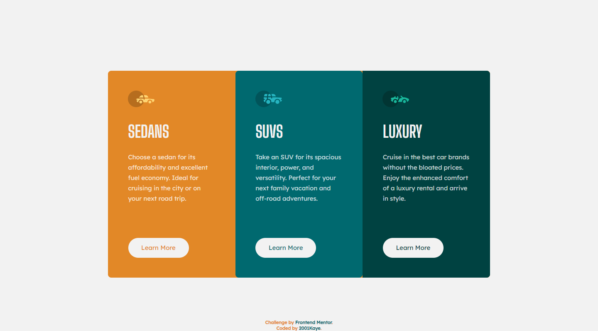

# Frontend Mentor - 3-column preview card component solution

This is a solution to the [3-column preview card component challenge on Frontend Mentor](https://www.frontendmentor.io/challenges/3column-preview-card-component-pH92eAR2-). Frontend Mentor challenges help you improve your coding skills by building realistic projects.

## Table of contents

- [Overview](#overview)
  - [The challenge](#the-challenge)
  - [Screenshot](#screenshot)
  - [Links](#links)
- [My process](#my-process)
  - [What I learned](#what-i-learned)
- [Author](#author)

## Overview

### The challenge

Users should be able to:

- View the optimal layout depending on their device's screen size
- See hover states for interactive elements

### Screenshot





### Links

- Solution URL: [Solution](https://www.frontendmentor.io/solutions/3-column-preview-card-using-grid-yaxZpYw2A)
- Live Site URL: [Live site](https://jhan117.github.io/3-column-preview-card/)

## My process

**2022.02.08**
   
1. Sedans card
2. Suvs card
3. luxury card
   
Started : Use gird for RWD. but i think the key is SEDANS card.
   
Completed : I learned property values of background color.

### What I learned
[**CSS Syntax**](https://www.w3schools.com/cssref/pr_background-color.asp)
```
background-color: color|transparent|initial|inherit;
```
   
**Property Values**
| Value |	Description |
| ----- | ----------- |
| color |	Specifies the background color. Look at CSS Color Values for a complete list of possible color values. |
| transparent |	Specifies that the background color should be transparent. This is default |
| initial |	Sets this property to its default value. |
| inherit |	Inherits this property from its parent element. |

## Author

- Frontend Mentor - [@2001Kaye](https://www.frontendmentor.io/profile/jhan117)
- GitHub - [@2001Kaye](https://github.com/jhan117)
