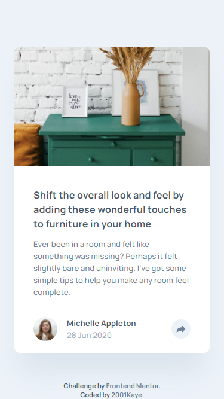
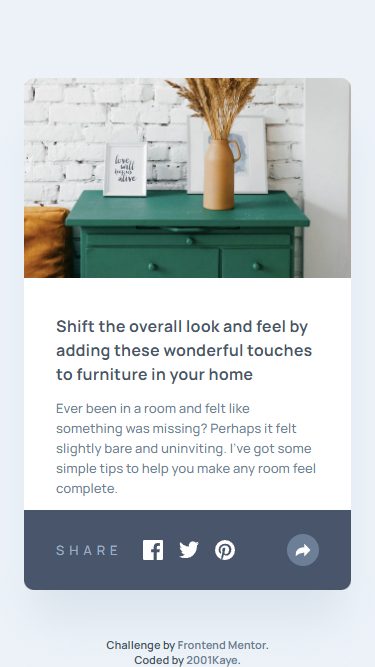
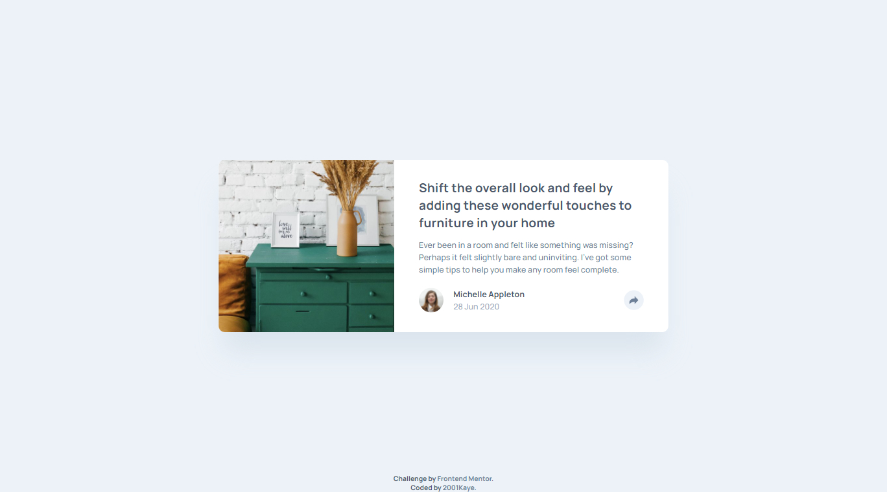
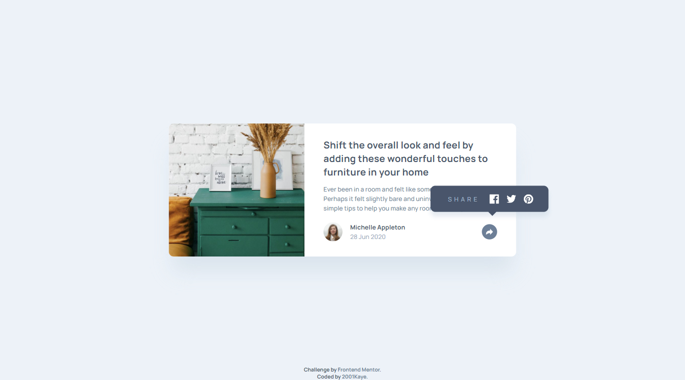

# Frontend Mentor - Article preview component solution

This is a solution to the [Article preview component challenge on Frontend Mentor](https://www.frontendmentor.io/challenges/article-preview-component-dYBN_pYFT). Frontend Mentor challenges help you improve your coding skills by building realistic projects. 

## Table of contents

- [Overview](#overview)
  - [The challenge](#the-challenge)
  - [Screenshot](#screenshot)
  - [Links](#links)
- [My process](#my-process)
  - [What I learned](#what-i-learned)
- [Author](#author)

## Overview

### The challenge

Users should be able to:

- View the optimal layout for the component depending on their device's screen size
- See the social media share links when they click the share icon

### Screenshot

### Links

- Solution URL: [Solution](https://www.frontendmentor.io/solutions/article-preview-using-js-wAJV0EWkt)
- Live Site URL: [Live site](https://jhan117.github.io/Article-preview/)

## My process

**2022.03.05**
   
- image
- content
- footer
- share (JS)
   
Started: javascript는 처음이라 좀 많이 무서운데 ㅎㅎ... 일단 전체적으로 레이아웃 변화가 있기 때문에 grid로 해줄거고 내용은 flex로 간단하게 해주고 밑에 footer에 flex로 묶어준 다음 저 link 창을 onclick 이벤트로 써주면 될듯...? style property로는 display 어떠니..? ㅎㅎ 사실 궁금한게 display 말고도 할 수 있을까? 한 번 해봐야겠다. 아 그리고 반응형을 정리해놓으려고 빼놨는데 오히려 헷갈려서 그냥 합치기로 함 ㅎㅎ
   
**2022.03.06**
   
Completed: 사실 디자인을 js에서 전부 할 생각이었는데 js 무료 강의 계속 돌아다니면서 보다가 디자인은 css 에서 하는 것이 좋다고 목적에 맞는 용도로 사용하라길래 그것도 맞지~ 싶어서 바로 css로 디자인 했다. 그런데 문제는 js는 처음이라 이것저것 막 해보면서 안되면 저거 붙여보고 이런 식으로 해가지고 코드가 좀 그 디자인 부분만 지저분한 감이 있다... 휴.. 아직은 배우는 중이니까 경험이 쌓이면 어떻게 해결할지 눈에 보일 때까지 js만 파야겠다. 그러면 코드도 좀 깔끔해지겠지! 나중에 좀 더 익숙해지면 업데이트 하겠다.

### What I learned

[**JavaScript Variables**](https://www.w3schools.com/js/js_variables.asp)
   
[**The HTML DOM Document Object**](https://www.w3schools.com/js/js_htmldom_document.asp)
   
[**JavaScript HTML DOM Elements**](https://www.w3schools.com/js/js_htmldom_elements.asp)
   
[Document.querySelector()](https://developer.mozilla.org/en-US/docs/Web/API/Document/querySelector)
   
[**Element.classList**](https://developer.mozilla.org/en-US/docs/Web/API/Element/classList)
   
[**EventTarget.addEventListener()**](https://developer.mozilla.org/en-US/docs/Web/API/EventTarget/addEventListener)

## Author

- Frontend Mentor - [@2001Kaye](https://www.frontendmentor.io/profile/jhan117)
- GitHub - [@2001Kaye](https://github.com/jhan117)
