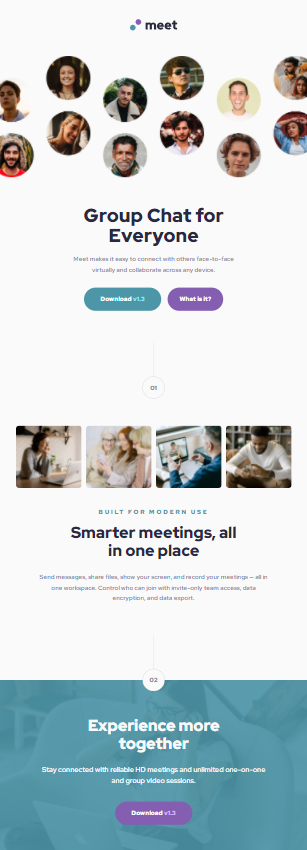
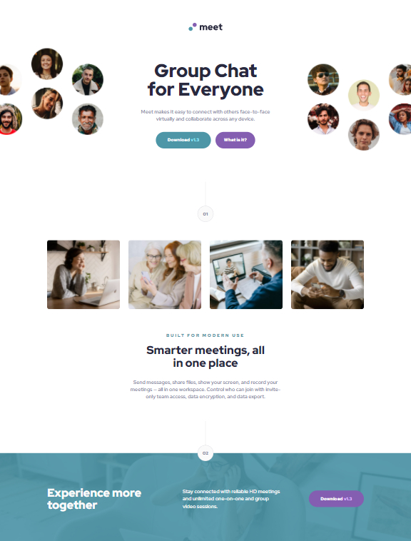
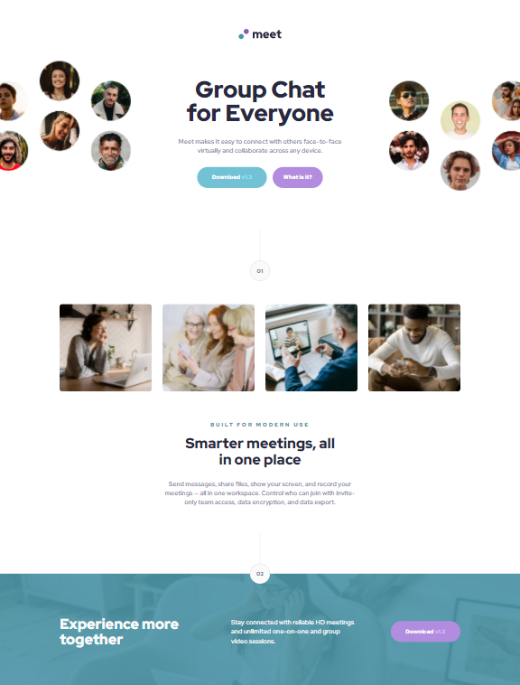

# Frontend Mentor - Meet landing page solution

This is a solution to the [Meet landing page challenge on Frontend Mentor](https://www.frontendmentor.io/challenges/meet-landing-page-rbTDS6OUR). Frontend Mentor challenges help you improve your coding skills by building realistic projects. 

## Table of contents

- [Overview](#overview)
  - [The challenge](#the-challenge)
  - [Screenshot](#screenshot)
  - [Links](#links)
- [My process](#my-process)
  - [What I learned](#what-i-learned)
- [Author](#author)

## Overview

### The challenge

Users should be able to:

- View the optimal layout depending on their device's screen size
- See hover states for interactive elements

### Screenshot

### Links

- Solution URL: [Solution](https://www.frontendmentor.io/solutions/meet-landing-page-using-grid-fO9aTRnbW)
- Live Site URL: [Live site](https://jhan117.github.io/Meet-landing-page/)

## My process

**2022.03.04**
   
- image
- content + buttons
  - 01 design
- image
- content
  - 02 design
- content + button
   
Started: 위 처럼 3부분으로 나누고 간단한 레이아웃 변화는 flex로 복잡한 것은 grid로 할 생각이다. 따라서 첫 번째 부분은 grid, 두 번째 부분은 이미지만 따로 flex wrap을 이용해서 해도 될 것 같다. 이미지와 내용 포함해서는 flex로 간단하게 정렬할 생각이다. 마지막 content 부분은... flex나 grid 어느 것을 사용해도 괜찮지만... grid로 할 생각이다. 아 또한, 로고는 백그라운드에 넣을 거다. 근데 저 01이랑 같이 있는 부분을 뭐라 불러야하는지 모르겠네 ㅋㅋㅎㅎ...
   
Completed: 첫 부분의 이미지가 데스크탑용 하나만 있는 줄 알고 img 태그로 불렀는데 알고 보니 모바일/태블릿 용도 있길래 바로 백그라운드에 넣었다. 쪽수인지 페이지인지 모를 디자인은 css battle 사이트에서 종종 해봤던터라 어렵지 않았다. 문제는 footer에 이미지 위에 컬러를 입히는게 조금 어려웠는데 지금은 익숙해진 것 같다. breakpoint도 적절하게 넣도록 열심히 페이지를 이리저리 해봤다. 아 근데 제목 부분에서 버튼 부분을 묶을까 말까 고민했는데 결국 안 묶었다. 그래서 조금 안 이쁜 것 같다. 다음에는 그냥 묶어야지 나중에 또한 이것도 업데이트 하겠다. (사실 오늘 컨디션 별로라서 다 못할 줄 알았는데 바로 다했다 ㅎㅎ)

### What I learned

[**Header Tag**](https://www.w3schools.com/tags/tag_header.asp)

The `header` element represents a container for introductory content or a set of navigational links.
   
A `header` element typically contains:
- one or more heading elements (`h1` - `h6`)
- logo or icon
- authorship information
   
Note: You can have several `header` elements in one HTML document. However, `header` cannot be placed within a `footer`, `address` or another `header` element.

## Author

- Frontend Mentor - [@2001Kaye](https://www.frontendmentor.io/profile/jhan117)
- GitHub - [@2001Kaye](https://github.com/jhan117)
