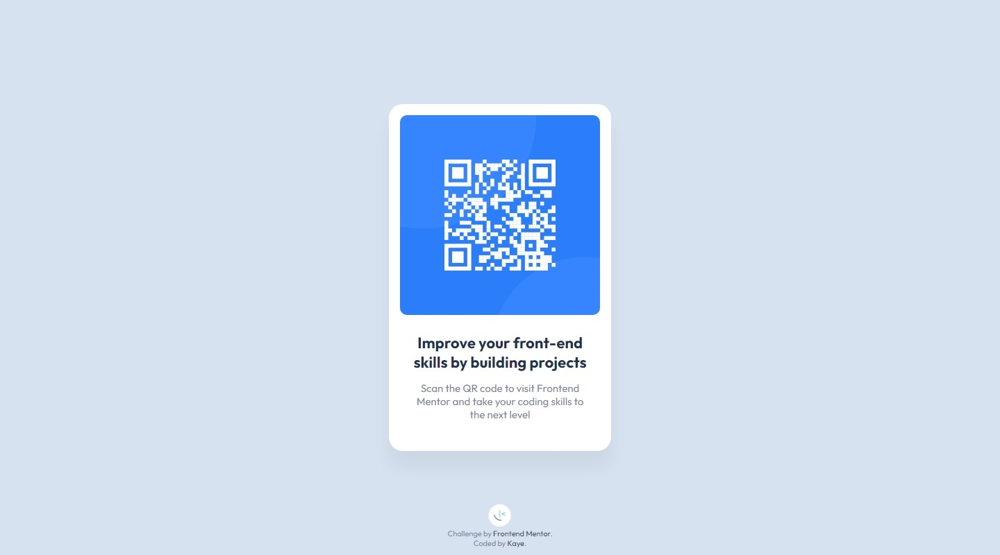

# Frontend Mentor - QR code component solution

This is a solution to the [QR code component challenge on Frontend Mentor](https://www.frontendmentor.io/challenges/qr-code-component-iux_sIO_H). Frontend Mentor challenges help you improve your coding skills by building realistic projects.

## Table of contents

- [Overview](#overview)
  - [Screenshot](#screenshot)
  - [Links](#links)
- [My process](#my-process)
  - [Built with](#built-with)
  - [What I learned](#what-i-learned)
  - [Continued development](#continued-development)
  - [Useful resources](#useful-resources)
- [Author](#author)
- [Acknowledgments](#acknowledgments)

**Note: Delete this note and update the table of contents based on what sections you keep.**

## Overview

### Screenshot




### Links

- Solution URL: [solution](https://www.frontendmentor.io/solutions/qr-code-pages-using-css-position-and-transform-bKkcYkyZT)

## My process

### Built with

- Semantic HTML5 markup
- CSS custom properties

### What I learned

When your image is one folder down as in the following structure:

html-project  
├── assets  
│        └── image.jpeg  
└── index.html  

Then you need to add the folder assets to the src attribute as follows:

```html

```
Ref : https://sebhastian.com/html-image-not-showing/

```css
.center
{
    position: absolute;
    top: 50%;
    left: 50%;
    transform: translate(-50%, -50%);
}
```

### Continued development

I will continue the easy projects. Because i need time to organize the knowledge i have learned so far.

### Useful resources

I like w3schools site... hahaha

## Author

- Frontend Mentor - [@jhan117](https://www.frontendmentor.io/profile/jhan117)
- GitHub - [@jhan117](https://github.com/jhan117)

## Acknowledgments

It's easy if you can put the component in the center.
