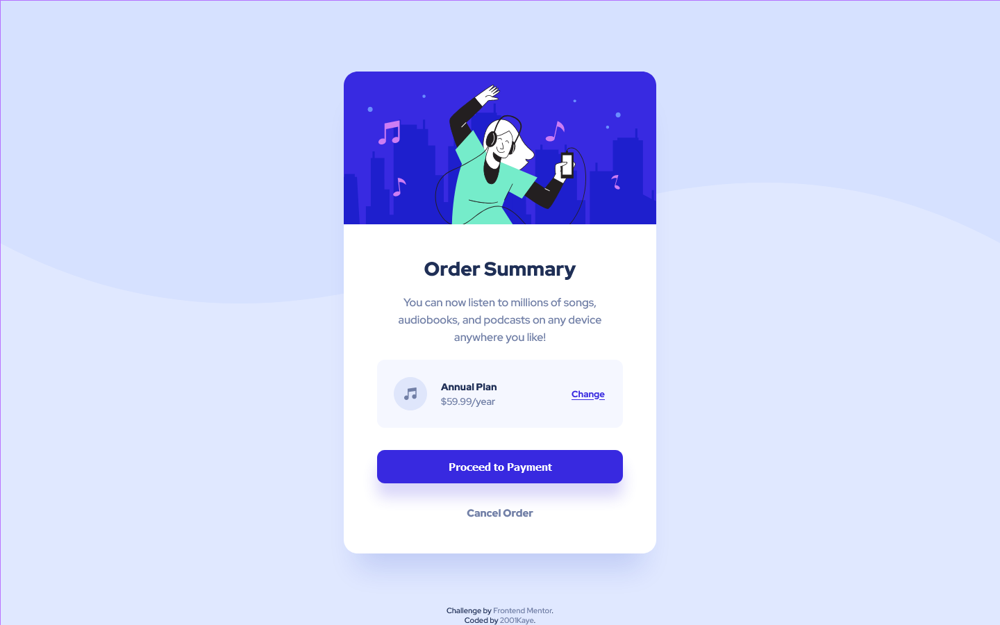

# Frontend Mentor - Order summary card solution

This is a solution to the [Order summary card challenge on Frontend Mentor](https://www.frontendmentor.io/challenges/order-summary-component-QlPmajDUj). Frontend Mentor challenges help you improve your coding skills by building realistic projects. 

## Table of contents

- [Overview](#overview)
  - [The challenge](#the-challenge)
  - [Screenshot](#screenshot)
  - [Links](#links)
- [My process](#my-process)
  - [Built with](#built-with)
  - [What I learned](#what-i-learned)
  - [Continued development](#continued-development)
  - [Useful resources](#useful-resources)
- [Author](#author)
- [Acknowledgments](#acknowledgments)

## Overview

### The challenge

Users should be able to:

- See hover states for interactive elements

### Screenshot

### Links

- Solution URL: [Solution](https://www.frontendmentor.io/solutions/order-summary-HpW1zvHOH)
- Live Site URL: [Live site](https://jhan117.github.io/Order-summary-component/)

## My process

### Built with

- Semantic HTML5 markup
- CSS custom properties
- Flexbox
- Mobile-first workflow
- RWD

### What I learned

- background-image
- button

### Continued development

I think I need to learn more about RWD...

### Useful resources

- background-image - [w3schools](https://www.w3schools.com/cssref/pr_background-image.asp)

## Author

- Frontend Mentor - [@2001Kaye](https://www.frontendmentor.io/profile/jhan117)
- Twitter - [@2001Kaye](https://github.com/jhan117)

## Acknowledgments

- button
- background-image