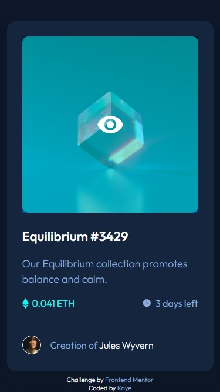
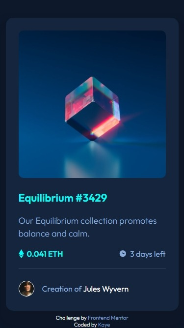
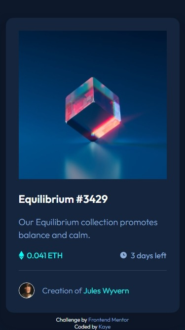

# Frontend Mentor - NFT preview card component solution

This is a solution to the [NFT preview card component challenge on Frontend Mentor](https://www.frontendmentor.io/challenges/nft-preview-card-component-SbdUL_w0U). Frontend Mentor challenges help you improve your coding skills by building realistic projects. 

## Table of contents

- [Overview](#overview)
  - [The challenge](#the-challenge)
  - [Screenshot](#screenshot)
  - [Links](#links)
- [My process](#my-process)
  - [Built with](#built-with)
  - [What I learned](#what-i-learned)
  - [Continued development](#continued-development)
  - [Useful resources](#useful-resources)
- [Author](#author)
- [Acknowledgments](#acknowledgments)

## Overview

### The challenge

Users should be able to:

- View the optimal layout depending on their device's screen size
- See hover states for interactive elements

### Screenshot

  

### Links

- Solution URL: [Solution](https://your-solution-url.com)
- Live Site URL: [Live site](https://jhan117.github.io/NFT-preview-card-component/)

## My process

### Built with

- HTML
- SASS(SCSS)
- CSS Flexbox
- CSS Grid
- Mobile-first workflow
- Responsive Web Design(RWD)

### What I learned

I used SASS(SCSS) for the first time. and i learned about RWD more.
Also i learned overlay!

### Continued development

- CSS advanced

### Useful resources

- RWD tutorial site : RWD tutorial site](https://www.w3schools.com/css/css_rwd_intro.asp) - This helped me for RWD.
- SASS(SCSS) tutorial site :
[SASS tutorial site in w3schools](https://www.w3schools.com/sass/default.php) - This helped me for SASS
[SASS tutorial site in official](https://sass-lang.com/guide)
[SASS tutorial video in youtube](https://www.youtube.com/watch?v=_a5j7KoflTs&t=612s) - This helped me for SASS settings.

## Author

- Frontend Mentor - [@2001Kaye](https://www.frontendmentor.io/profile/jhan117)
- GitHub - [@2001Kaye](https://github.com/jhan117)

## Acknowledgments

I think overlay and RWD were the key.