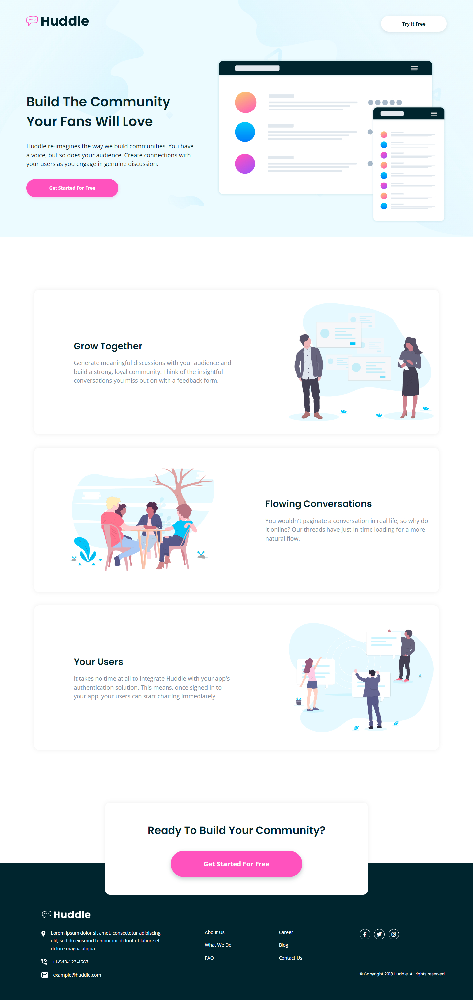

# Frontend Mentor - Profile card component solution

This is a solution to the [Profile card component challenge on Frontend Mentor](https://www.frontendmentor.io/challenges/profile-card-component-cfArpWshJ). Frontend Mentor challenges help you improve your coding skills by building realistic projects. 

## Table of contents

- [Overview](#overview)
  - [The challenge](#the-challenge)
  - [Screenshot](#screenshot)
  - [Links](#links)
- [My process](#my-process)
- [Author](#author)

## Overview

### The challenge

- Build out the project to the designs provided

### Screenshot

### Links

- Solution URL: [solution](https://www.frontendmentor.io/solutions/profile-card-CtYYIHGFM)
- Live Site URL: [live site](https://jhan117.github.io/Profile-card/)

## My process

**Updated 2022.Feb.26**   
[List]
- card
- hero image
- profile image
- content
- horizontal bar
- stats
   
[Feature]
1. Card
2. RWD using max-width and grid

---

background image 위치 조정이 어렵네.. 어떻게 하면 더 좋을까? %로 했더니 높이가 안 맞아서 조금만 길어지면 사라짐 ㅠㅠ

**Updated 2022.Feb.27**   
는 offset으로 했더니 원하는 결과물이 나왔다~

## Author

- Frontend Mentor - [@2001Kaye](https://www.frontendmentor.io/profile/jhan117)
- Twitter - [@2001Kaye](https://github.com/jhan117)