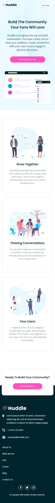

# Frontend Mentor - NFT preview card component solution

This is a solution to the [NFT preview card component challenge on Frontend Mentor](https://www.frontendmentor.io/challenges/nft-preview-card-component-SbdUL_w0U). Frontend Mentor challenges help you improve your coding skills by building realistic projects. 

## Table of contents

- [Overview](#overview)
  - [The challenge](#the-challenge)
  - [Screenshot](#screenshot)
  - [Links](#links)
- [My process](#my-process)
  - [Built with](#built-with)
  - [What I learned](#what-i-learned)
  - [Continued development](#continued-development)
  - [Useful resources](#useful-resources)
- [Author](#author)
- [Acknowledgments](#acknowledgments)

## Overview

### The challenge

Users should be able to:

- View the optimal layout depending on their device's screen size
- See hover states for interactive elements

### Screenshot





### Links

- Solution URL: [Solution](https://www.frontendmentor.io/solutions/nft-preview-card-using-sass-rwd-RlxqtrTi8)
- Live Site URL: [Live site](https://jhan117.github.io/NFT-preview-card-component/)

## My process

### Built with

- HTML
- SASS(SCSS)
- CSS Flexbox
- CSS Grid
- Mobile-first workflow
- Responsive Web Design(RWD)

### What I learned

I used SASS(SCSS) for the first time. and i learned about RWD more.
Also i learned overlay!

- HTML Page Width and Height Settings:
```CSS
/* CSS Reset  */
* {
  margin: 0;
  padding: 0;
  box-sizing: border-box;
}

body {
  min-height: 100vh;
}
```
- Using Rem units:
10px = 0.625rem
16px = 1rem
```CSS
body {
  font-size: 62.5%; /* = 10px */
}
```
Creating a base font-size that you don’t actually need means you have to redefine nigh on every element to take on the size you do want–you’re creating a rule that you don’t even want and it’s causing you work…

### Continued development

- CSS advanced

### Useful resources

- RWD tutorial site : [RWD tutorial site](https://www.w3schools.com/css/css_rwd_intro.asp) - This helped me for RWD.
- SASS(SCSS) tutorial site :   
[SASS tutorial site in w3schools](https://www.w3schools.com/sass/default.php) - This helped me for SASS   
[SASS tutorial site in official](https://sass-lang.com/guide)   
[SASS tutorial video in youtube](https://www.youtube.com/watch?v=_a5j7KoflTs&t=612s) - This helped me for SASS settings.   
- HTML Page Width and Height Settings : [Youtube](https://www.youtube.com/watch?v=dpuKVjX6BJ8&t=161s)
- px to rem : [Pixel to REM conversion table](https://www.croydon.gov.uk/design-and-content-guidelines/resources/pixel-rem-conversion-table)

## Author

- Frontend Mentor - [@2001Kaye](https://www.frontendmentor.io/profile/jhan117)
- GitHub - [@2001Kaye](https://github.com/jhan117)

## Acknowledgments

I think overlay and RWD were the key.