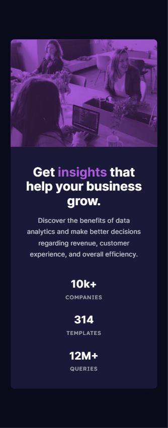

# Frontend Mentor - Stats preview card component solution

This is a solution to the [Stats preview card component challenge on Frontend Mentor](https://www.frontendmentor.io/challenges/stats-preview-card-component-8JqbgoU62). Frontend Mentor challenges help you improve your coding skills by building realistic projects. 

## Table of contents

- [Overview](#overview)
  - [The challenge](#the-challenge)
  - [Screenshot](#screenshot)
  - [Links](#links)
- [My process](#my-process)
- [Author](#author)

## Overview

### The challenge

Users should be able to:

- View the optimal layout depending on their device's screen size

### Screenshot




### Links

- Solution URL: [solution](https://your-solution-url.com)
- Live Site URL: [live site](https://jhan117.github.io/Stats-preview-card/)

## My process

**Updated 2022.Feb.24**   

- Breakpoint: 1440px
- Use mix-blend-mode for image
   
[card list]
1. image
2. content
3. stats
   
content : left
image : right
   
problem: float div height 0
1. `overflow: auto (or hidden);`

2. 
```HTML
<div id="outer">
    <div id="left">
         ...
    <div id="right">
    <div style="clear:both"></div>
</div>
```

3. set height
4. display : inline-block
5. set float

**Updated 2022.Feb.27**   
그냥 조금 정리했다. 배열도 맞추고? 위치 조정함

## Author

- Frontend Mentor - [@2001Kaye](https://www.frontendmentor.io/profile/jhan117)
- GitHub - [@2001Kaye](https://github.com/jhan117)
