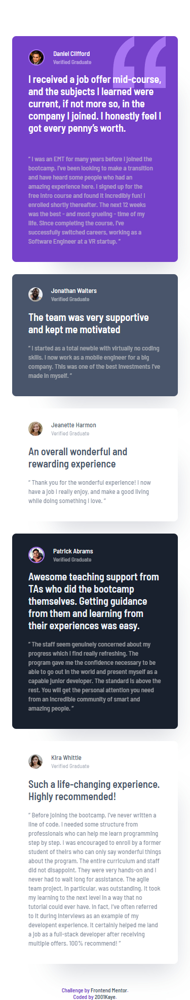
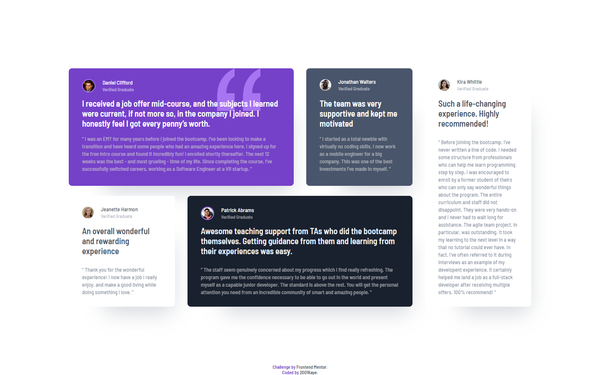

# Frontend Mentor - Testimonials grid section solution

This is a solution to the [Testimonials grid section challenge on Frontend Mentor](https://www.frontendmentor.io/challenges/testimonials-grid-section-Nnw6J7Un7). Frontend Mentor challenges help you improve your coding skills by building realistic projects. 

## Table of contents

- [Overview](#overview)
  - [The challenge](#the-challenge)
  - [Screenshot](#screenshot)
  - [Links](#links)
- [My process](#my-process)
  - [Built with](#built-with)
  - [What I learned](#what-i-learned)
- [Author](#author)

## Overview

### The challenge

Users should be able to:

- View the optimal layout for the site depending on their device's screen size

### Screenshot

### Links

- Solution URL: [Solution](https://www.frontendmentor.io/solutions/testimonials-grid-section-kIcTDOt3B)
- Live Site URL: [Live site](https://jhan117.github.io/Testimonials-grid-section/)

## My process

**2022.03.12**
   
Started: 디자인이 완전 야 grid 써 이건데?ㅋㅋㅋㅋ
   
Completed: 굳 breakpoint는 그냥 글자 보일정도로 줬다. 반응형 지금까지 했던 것 중에서 제일 맘에 든다 ㅎㅎ grid 높이 값을 고정시키려다가 말았는데 고정 시키는 것보다 좋은듯...?
   
수정 해야 할 것들: 배경색, image에 border 있는 친구들 padding-left 값 조절, jonathan 본문 글자색, patrick 본문 넓이

### Built with

- HTML
- CSS
  - SASS
- Mobile-first workflow

### What I learned

[minmax() - grid](https://developer.mozilla.org/en-US/docs/Web/CSS/minmax())

## Author

- Frontend Mentor - [@2001Kaye](https://www.frontendmentor.io/profile/jhan117)
- GitHub - [@2001Kaye](https://github.com/jhan117)
